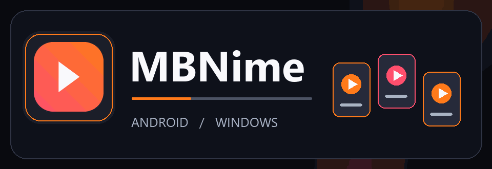

# ام‌بی‌انیمه | MBNime

**انیمه‌های محبوبت، همیشه یک قدم نزدیک‌تر**

🎬 تماشا &nbsp;·&nbsp; 🔎 کشف &nbsp;·&nbsp; 📥 دانلود &nbsp;·&nbsp; ❤️ علاقه‌مندی

[دریافت برای اندروید و ویندوز](https://github.com/MBNpro-ir/MBNime-App/releases/latest)

---

## دنیای انیمه، مرتب و در دسترس

| برای پیدا کردن | برای تماشا | برای نگه داشتن |
| :---: | :---: | :---: |
| 🔎 جست‌وجوی انیمه‌ها و مرور فصل‌ها و قسمت‌ها | ▶️ پخش درون برنامه با زیرنویس و کنترل‌های کاربردی | 📥 مدیریت دانلودها در پوشه‌های مرتب |
| 🧭 رسیدن سریع به عنوان دلخواه | 📺 پخش روی نمایشگر سازگار | ❤️ علاقه‌مندی‌ها و ادامهٔ تماشا |

## از کجا شروع کنم؟

1. از دکمهٔ **دریافت** در بالای صفحه، نسخهٔ مناسب دستگاهت را نصب کن.
2. با **ایمیل یا نام کاربری** حساب خودت وارد شو. اگر در MBNMovie وارد شده‌ای، می‌توانی ورود با همان حساب را انتخاب کنی.
3. انیمه‌ات را پیدا کن، قسمت دلخواه را باز کن و تماشا را شروع کن.

> نمایش محتوا و امکان پخش یا دانلود به دسترسی حساب و آماده بودن لینک‌های هر عنوان بستگی دارد.

## تماشای راحت‌تر

- **در اندروید:** هنگام پخش می‌توانی از تصویر در تصویر استفاده کنی و در صورت پشتیبانی دستگاه، تصویر را به نمایشگر دیگری بفرستی.
- **در ویندوز:** کنترل‌های صفحه‌کلید، جابه‌جایی در ویدئو و تغییر حالت تمام‌صفحه در دسترس‌اند.
- **برای بعد:** عنوان‌ها را به علاقه‌مندی‌ها اضافه کن یا از بخش «ادامهٔ تماشا» به همان جایی برگرد که مانده بودی.

## اشتراک و پشتیبانی

از منوی برنامه وارد **مدیریت اشتراک** شو تا وضعیت اشتراک و زمان باقی‌مانده را ببینی. اگر برای ورود، پخش، دانلود یا اشتراک کمک خواستی، همان‌جا دکمهٔ **پشتیبانی** را بزن.

## به‌روزرسانی برنامه

برنامه نسخهٔ تازه را بررسی می‌کند. وقتی به‌روزرسانی ضروری شناسایی شود، صفحهٔ به‌روزرسانی باز می‌ماند و تا نصب نسخهٔ تازه بخش‌های دیگر در دسترس نیستند. در اندروید، تأیید نصب از سوی خود سیستم ممکن است لازم باشد. اگر دریافت فایل کامل نشد، از همان صفحه دوباره تلاش کن.

**آماده‌ای قسمت بعدی را ببینی؟**

[دریافت آخرین نسخه](https://github.com/MBNpro-ir/MBNime-App/releases/latest)

